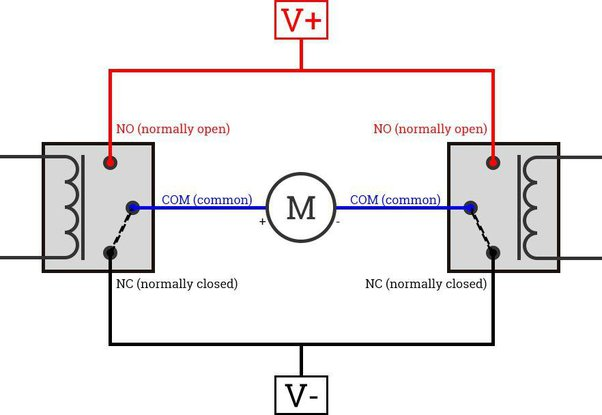

# Motor Driver Design

* I was asked to design a motor driver board to control 30 amp 12 volt motors.
* I designed a printed circuit board to control the motors using the AUTODESK EAGLE program.
* This motor driver was used to control motors in a specific industry and worked reliably.
* I used relays because they were the best choice for the customer due to their low cost.
 

